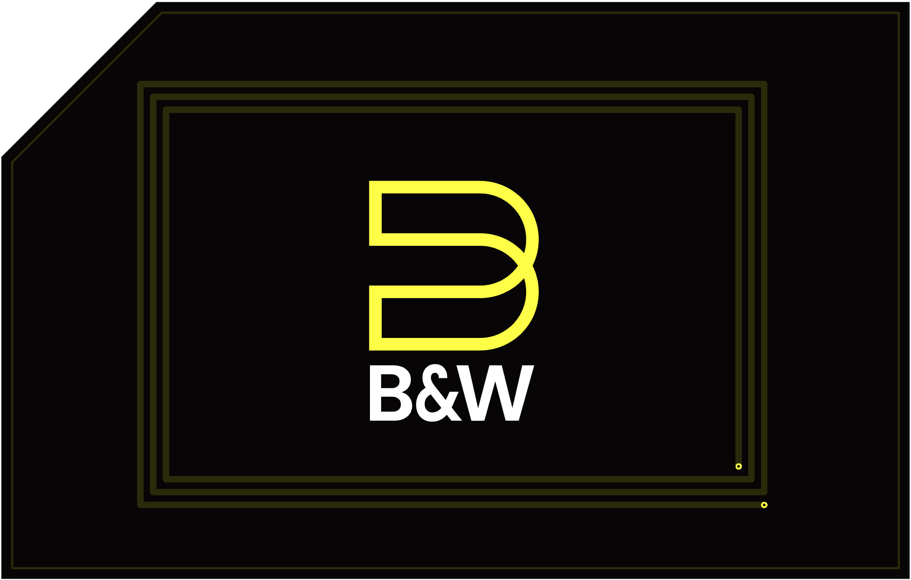
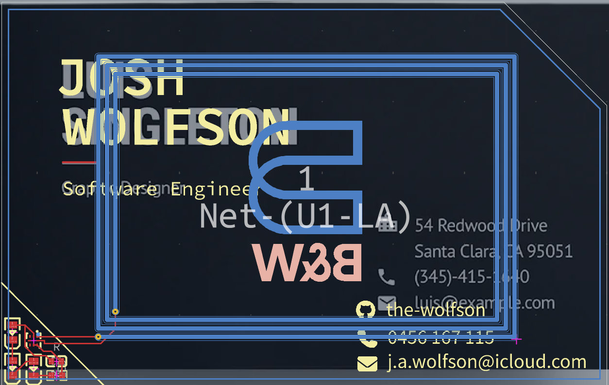

#  Business Card
An NFC PCB business card with LED feedback.

## BOM
|Comment|Part|Quantity|LCSC ID|Price|
|-|-|-|-|-|
NFC Chip|NT3H2111W0FHKH    |1|C710403|$4.43
Capacitor|CL10B224KA8NNNC|1|C21120|$0.56
Resistor|0603WAF470JT5E|1|C23182|$0.11
LED|KT-0805R|3|C2295|$0.53
PCB|5|||$4.00
PCBA|2|||$18.37
Shipping||||$8.14
**Total: $36.14**

## Use
Hold your phone to the card, and the website will open.

## Justification
I need a way to easily point people to my website, this was the solution. A card with a small yet distinct form factor, recognisable even from a distance.

The real  challenge is getting it cheap enough that it can be produced at scale.
